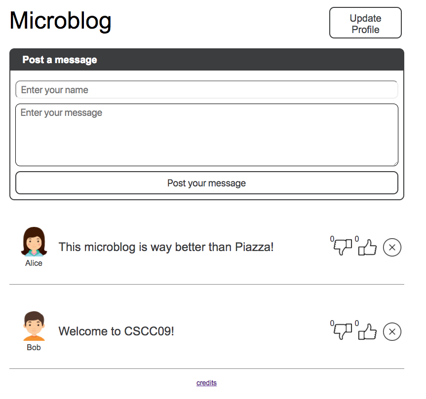

[](https://classroom.github.com/a/AqEuZnNG)
# HTML & CSS

In this lab, you are going to make your first steps with HTML and CSS. Your goal is to design the UI of our Microblog app. This app should look like similar to the following screenshot:

<div class="screenshot"></div>

This handout is meant to guide your learning experience by giving you problems to solve. However, it it will not tell you how to solve these problems. In most cases, you will need to find the solution on your own. We strongly recommend that you use the resources and code example provided in lecture 1 first. Then uses the resources from the web. If you have questions, the TA is here to help.

### Recommended work setup

After cloning this repository, you are now ready to start working on the frontend of your application. You should have two windows visible on your screen: the browser with your webpage and the code editor.

You are free to choose whatever code editor you want. However make sure that you have syntax highlighting for HTML, CSS and Javascript at least. Finally, make sure that when you save your code (using keyboard shortcut), your page is automatically refreshed in the browser. Some code editors like VS code provide that feature. If your code editor does not have this feature, we recommend you to work with [browser-sync](https://www.browsersync.io/) to automatically refresh your browser once any of your file is saved:

```
$ browser-sync start --server --no-online --files="**/*"
```

At this point, you should have an open tab in your Chrome browser with the URL: `http://localhost:3000/`.

From now on, we recommend you to keep the Chrome developer's console opened (menu view -> Developer -> Developer Tools).

### Submission

All of your work should be done through your local copy of your Github repository. Once you are done with the lab, push your work to Github:

```shell
$ git add -A
$ git commit -m "Final submission for Lab 02"
$ git push
```

Make sure that your code is on Github `https://github.com/UTSCC09/lab02-__your_github_username__`

## 1. Setting up the web application

As you can see so far, our web application is stretching to the maximum size of the browser window. Depending on how you design your web application, it might look completely different with other size of browser window. Ideally, we would like our web application to be [responsive](https://en.wikipedia.org/wiki/Responsive_web_design) to work on any screen size (including mobile devices). However, this is something more advanced that will be covered later this semester. For now, we will just fix the browser window width to a size that should work on most computer screens.

**Task:** Modify the CSS file `main.css` to fix the width of the `body` element using the following properties:

```
    max-width: 60%;   /* set the body to be 60% of the screen width */
    margin: auto;       /* center the app in the middle of the browser window */
```

At this point, you should see the Microblog application centered with a fixed width.

## 2. Working with HTML Forms

The main page contains an example of an HTML form. So far, this form contains an input element that asks the user to enter a name. We want to modify this form to post a longer message instead of a name.

**Task:** Without modifying the CSS file `form.css`:

1. add a `textarea` element that matches the style defined by the class `form_element` in the `form.css` file. The textarea placeholder should now be _"enter your message_".
1. add a input button of type submit that matches the style defined by the class `btn` the `form.css` file.

At this point, the user should be able to fill the form and hit the button submit. This action will make the page to refresh for now. In the next lab, we will learn how to attach a Javascript method to the submit action.

## 3. Building an HTML structure

The goal of our app is to show all posted messages on the main page below the form. As shown on the screenshot above, each message contains the following elements:

1. the name of the user who posted the message
1. the user profile picture
1. the message content
1. three icons for up-voting, down-voting and deleting the message

**Task:** Define an HTML data structure for a message and add two examples of these messages in the main page below the message form. For now, you can set the user profile picture to the default one found in `media/user.png`.

At this point, you should see all of elements being stacked up in a disorganized way.

## 4. Understanding CSS

In this part, you are going to style your messages. To position the HTML elements, we recommend to use either the [Flexbox CSS layout](https://css-tricks.com/snippets/css/a-guide-to-flexbox/) or the [Grid CSS layout](https://css-tricks.com/snippets/css/complete-guide-grid/).

**Task:** Create a new stylesheet called `messages.css` to style your messages and add it to the `index.html` file. Then, style the message elements to look similar to the screenshot above. However, feel free to experiment further with CSS come up with your own style.

At this point, your messages should show on the page in an elegant way.

## 5. Dealing with images

There are two ways to place an image into a page:

1. by using the HTML element `img` and a reference attribute to the image source,
1. or by adding an image background to an HTML element with CSS

As a good practice, it is recommended to use the CSS method for all images that belongs to the UI and reserve the use of the `img` HTML tags to all images that are related to your data.

For instance, inside a message, the user's profile image could be considered as data that the can change dynamically. Therefore, we will use the `img` HTMl elements for that. However, the upvote, downvote and delete icons are part of the UI and we will use the CSS method method to attach an image to this button. If you decide to change the entire design of your app, you only need to update the CSS.

**Task:** Update your HTML and CSS accordingly. Plus, for each message, let us change the image profile with a specific one as shown on the screenshot above. You can use any image found on the internet as long as it is free of use _and_ that you correctly credit its author. For instance, you can find these image on websites such as:

- [Creative Commons](https://search.creativecommons.org/)
- [Flaticon](http://www.flaticon.com/)

For any image you use, you should credit its author on the credits page of you app (`credits.html`).

**Task:** Change the two profile pictures of your messages by

1. downloading two free of use images from the web in a new directory that you will call `uploads` (instead of `media` since these images are not part of the UI)
1. use these images in your messages
1. add the corresponding credits to the credits page
